# 🥗 ScanSanté - AI Food Ingredient Scanner

**ScanSanté** is an intelligent mobile application designed to help users make healthier food choices. By utilizing **OCR (Optical Character Recognition)** and **AI-based analysis**, the app scans food packaging labels to detect additives, allergens, and nutritional information instantly.

> *Making the invisible ingredients visible for your health.*

---

### 📸 App Walkthrough

A complete tour of the application from onboarding to detailed health analysis.

#### 🔹 Onboarding & Authentication
| **Splash Screen** | **Login / Sign Up** | **User Preferences** |
|:---:|:---:|:---:|
| 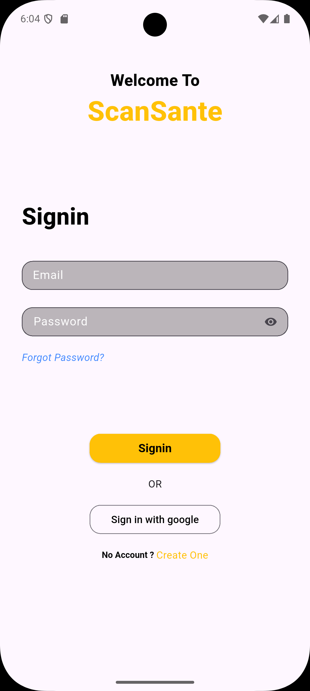 | 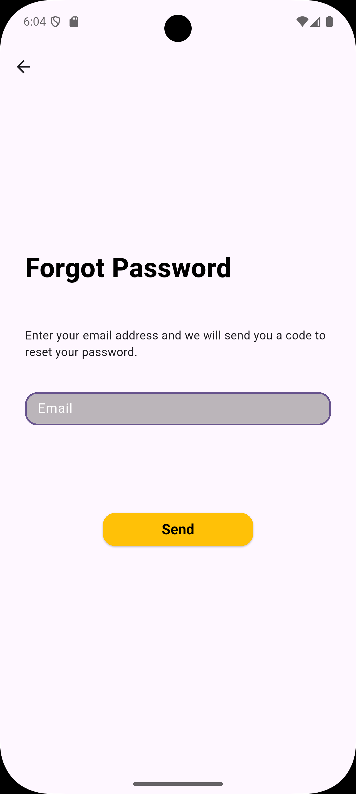 | 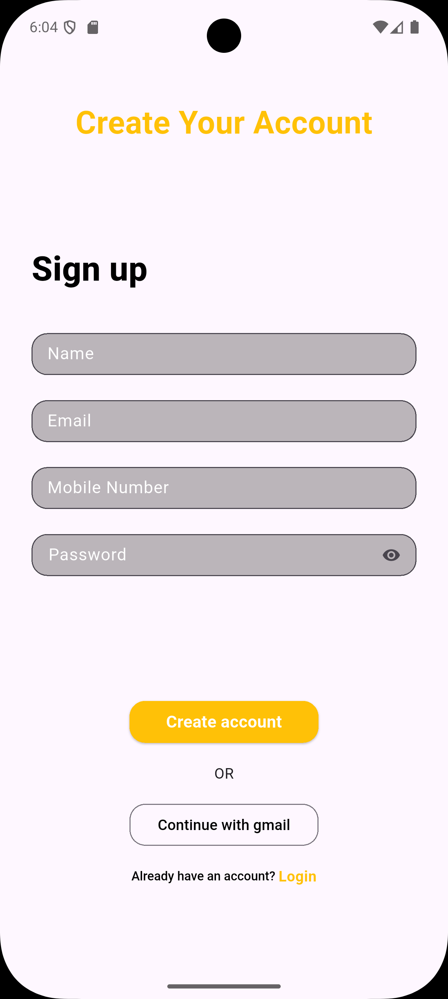 |

#### 🔹 Dashboard & Scanning
| **Home Dashboard** | **Camera / OCR Scan** | **Crop & Analyze** |
|:---:|:---:|:---:|
| 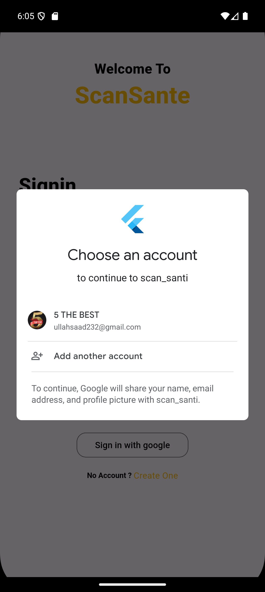 | 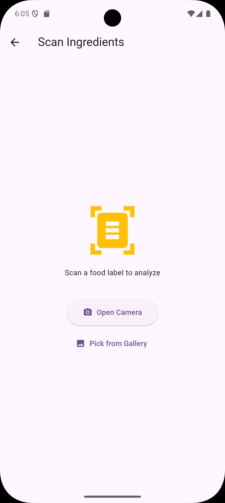 |  |

#### 🔹 Results & Analysis
| **Ingredient Analysis** | **Health Score** | **Allergen Alerts** |
|:---:|:---:|:---:|
| 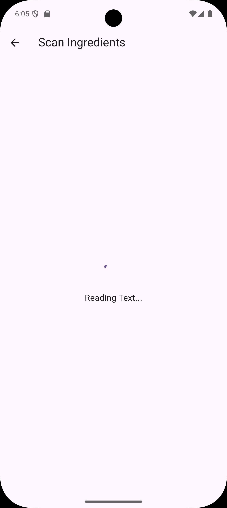 |  | 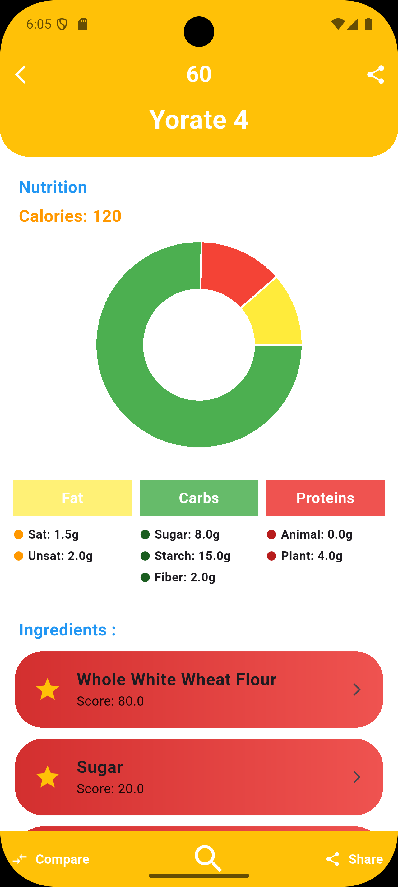 |

#### 🔹 History & Profile
| **Scan History** | **Saved Items** | **Profile Settings** |
|:---:|:---:|:---:|
| 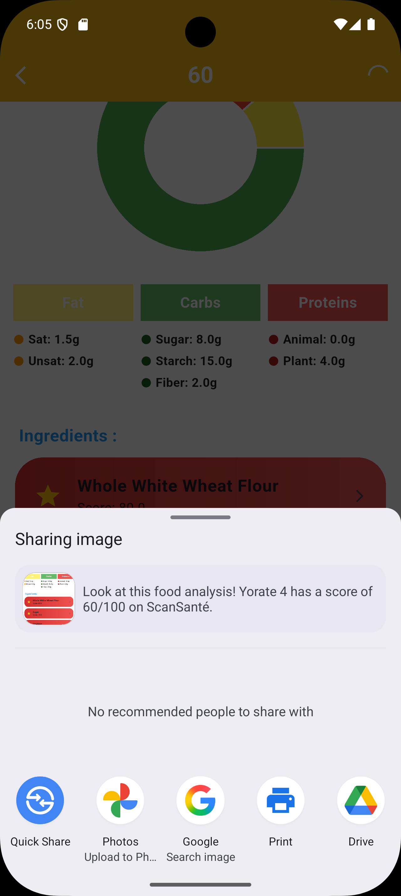 | 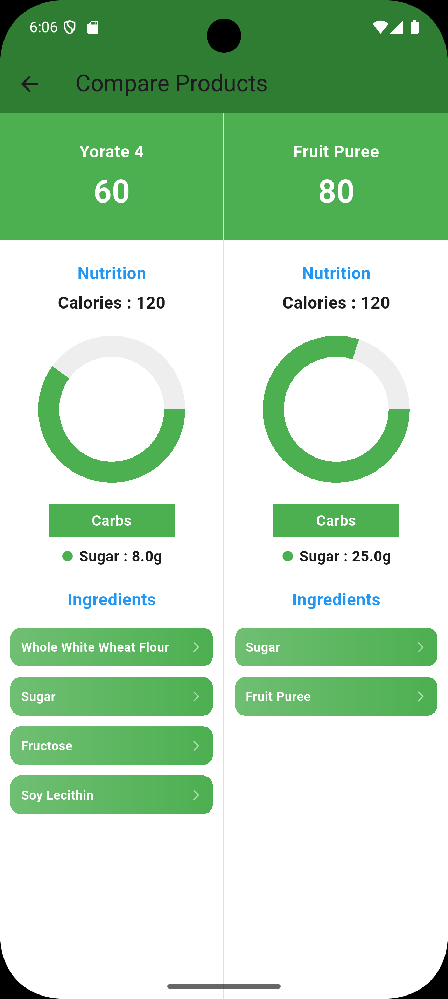 | 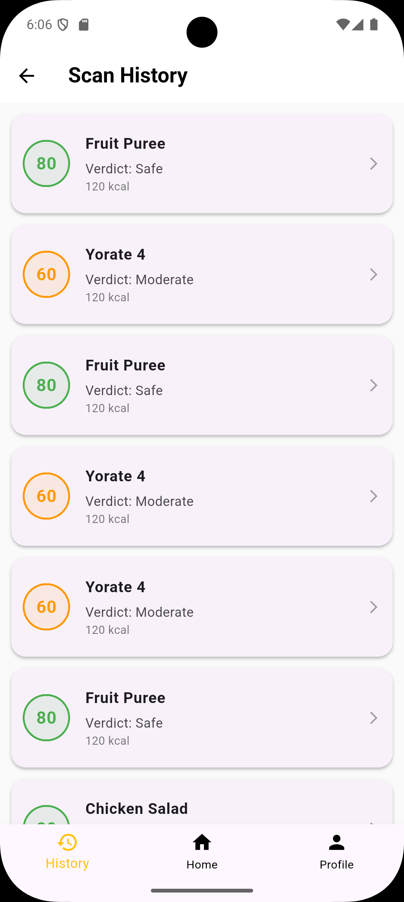 |

#### 🔹 Additional Features
| **Community / Extras** |
|:---:|
| 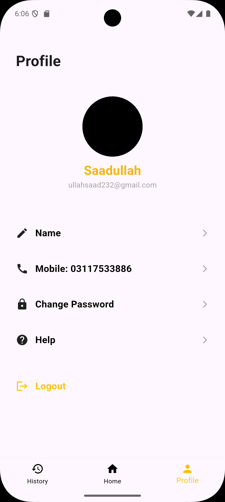 |

---

### 🛠️ Tech Stack

*  **Flutter** - Cross-platform UI.
*  **Dart** - Logic & Backend communication.
*  **Firebase** - Auth, Database & Cloud Functions.
* **Google ML Kit** - For on-device Text Recognition (OCR).
* **Provider** - For robust State Management.

---

### ✨ Key Features

* **🔍 AI-Powered OCR:** Instantly extracts text from food labels using the camera.
* **⚠️ Allergen Detection:** Automatically highlights ingredients that match the user's health profile (e.g., Gluten, Peanuts, Dairy).
* **📊 Health Scoring:** Assigns a health score to products based on additives and sugar content.
* **💾 Scan History:** Keeps a local and cloud log of all previously scanned items for quick reference.
* **👤 Custom Health Profiles:** Users can define their specific dietary restrictions (Vegan, Halal, Diabetic-friendly, etc.).

---

### 🚀 How to Run

1.  **Clone the repository**
    ```bash
    git clone [https://github.com/saadullah-001/ScanSante.git](https://github.com/saadullah-001/ScanSante.git)
    ```

2.  **Install dependencies**
    ```bash
    flutter pub get
    ```

3.  **Run the app**
    ```bash
    flutter run
    ```

---

### 👤 Author

**Muhammad SaadUllah**
* CS Student @ UCP
* [GitHub Profile](https://github.com/saadullah-001)
